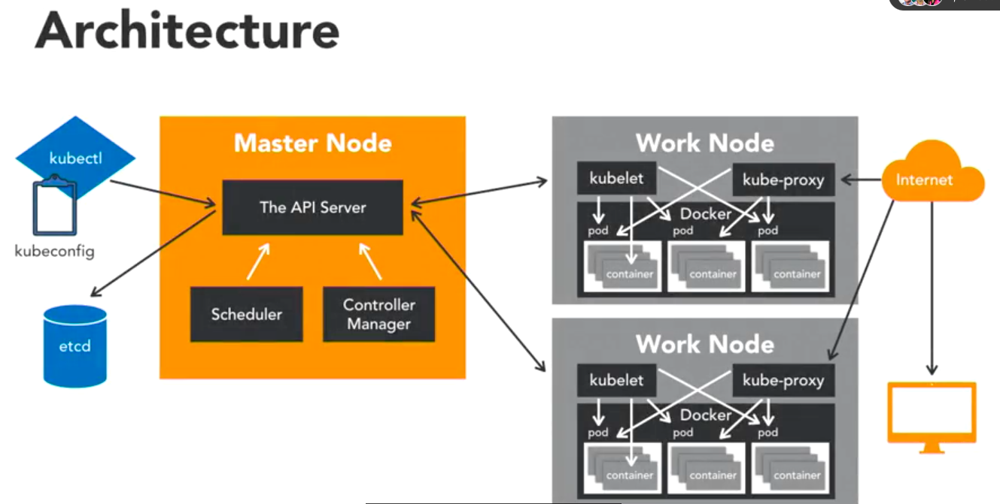

# Kubernetes - https://amdocs-1.gitbook.io/kubernetes-handbook



## Start local minikube server

`brew install minikube`

## Create a deployment

`kubectl create -f deployment.yaml`

Or if we want to replace the previous resource

`kubectl apply --force -f deployment.yaml`

## Clean resources

`kubectl delete service blog`
`kubectl delete deployment blog`

## Minikube

### Start

`minikube start`

### Enable ingress

`minikube addons enable ingress`

### Start Minikube Tunel
Without the tunnel, minikube will not forward requests to ingress

`minikube tunnel`

### Get IP

`minikube ip`

### Verify Ingress Configuration
Check if your Ingress resource is created and has the expected configuration:

```sh
kubectl get ingress -n <namespace>
kubectl describe ingress <ingress-name> -n <namespace>
```

Check ingress nginx

`kubectl get pods -n ingress-nginx`

Check the rules for the hostname
`kubectl describe ingress nginx-ingress`

### Stop

`minikube stop`

### Open a deployment in browser

`minikube service blog`
